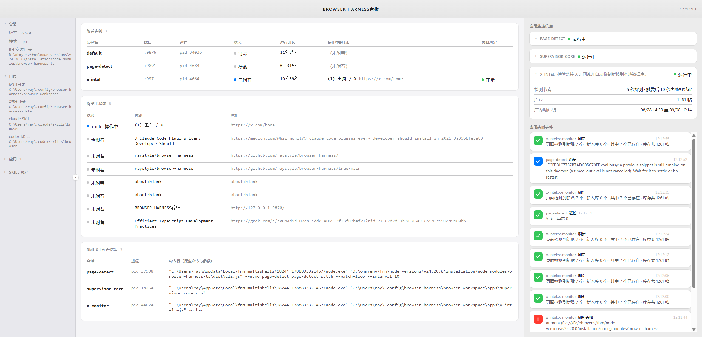

# Browser Harness（browser-harness-ts）

从 LLM 到 Chrome 的完整操控平台，两层 API 一条守护进程：

1. **协议层**："协议即 API"，CDP 全部 56 域 652 方法带类型直调，无封装遮蔽（源自 [browser-use/browser-harness-js](https://github.com/browser-use/browser-harness-js) 的忠实移植）
2. **语义层**：[browser-harness-py](https://github.com/raystyle/browser-harness-py)（Python 版）同名 snake_case 助手，tab 纪律、等待判官、登录墙策略、自愈；94 站 domain-skills 知识库即插即用

**运行时依赖白名单制**（仅 commander 与 zod 两项，其余全用 Node ≥22 内置 WebSocket/fetch/sqlite）；长驻 daemon 持久会话；**附着用户自己打开的浏览器、人机共存**（永不 spawn，只在专属 tab 工作，Chrome 144+ 官方 auto-connect 通道）；插件应用生态（web-fetch / 搜索 / cookie-io / page-detect 页面诊断 / super-ocr 验证码图识别 / x-intel X 监控全家桶）；只读网页看板；每动作一帧录制 + 视频合成。

---

# 第一部分：安装、部署、配置与更新

## 安装

要求 Node ≥ 22（原生 WebSocket 客户端）。三种方式按场景选：

### 方式一：git clone + 本地封版安装（当前推荐）

```bash
git clone https://github.com/raystyle/browser-harness.git
cd browser-harness
npm install            # 安装 devDependencies（typescript/esbuild/defuddle）
npm run build          # tsc 编译到 dist/
npm pack               # 打出 browser-harness-ts-<版本>.tgz（拷贝式包）
npm install -g ./browser-harness-ts-*.tgz   # 全局安装真拷贝（不是 link）
rm browser-harness-ts-*.tgz
bh --version           # 验证：应输出 package.json 里的版本号
```

> **注意**：`npm install -g .` 在部分平台会创建符号链接而非拷贝，导致 BH_HOME 落到源码目录（dev checkout 判定）；`npm pack` + 安装 tarball 才是干净的安装态。

### 方式二：GitHub Release 下载 tgz 安装（免 clone 源码）

从 [Releases](https://github.com/raystyle/browser-harness/releases) 下载 `browser-harness-ts-<版本>.tgz` 附件后：

```bash
npm install -g ./browser-harness-ts-0.5.0.tgz
bh --version   # -> 0.5.0
```

### 方式三：开发模式（源码直跑）

```bash
git clone https://github.com/raystyle/browser-harness.git
cd browser-harness
npm install && npm run build && npm link
# 开发模式 BH_HOME 自动用 <repo>/.bh-dev，不污染安装态的用户目录
```

Windows 上 npm 自动创建 `.cmd`/`.ps1`/sh 三种 shim，cmd、PowerShell、git-bash 均可直接用 `bh`。

## 部署初始化（用户数据目录）

安装态的 BH_HOME 固定为 `~/.config/browser-harness`（可用 `BH_HOME` 环境变量覆盖）。首次使用自动创建：

```
~/.config/browser-harness/
  browser-workspace/    # 应用（apps/）+ 站点知识（domain-skills/）+ SDK
  data/                 # 运行时数据（x_tweets.db、日志、心跳、状态文件）
  runtime/              # 实例注册表（bh-<name>.port）
  tmp/                  # 日志
```

手动铺装应用与站点知识（也可跳过，首次调用自动铺）：

```bash
bh skill sync --yes      # 铺装 workspace（apps + domain-skills + sdk，只增不删；默认 dry-run，--yes 执行）
bh doctor               # 体检：可附着浏览器 / daemon / 资产一致性
```

首次使用会判系统环境自动带起守护面：默认浏览器守护 + rmux 守护 + 看板 + page-detect watch + supervisor-core（幂等；Node ≥22 版本闸）。

## 浏览器附着开启（一次性）

bh 永不启动浏览器，它附着你自己打开的 Chrome（144+）：

1. 打开你的 Chrome，地址栏访问 `chrome://inspect/#remote-debugging`
2. 启用「Allow remote debugging for this browser instance」
3. 首次连接时 Chrome 会弹「Allow remote debugging?」确认框，点 Allow
4. 验证：`bh doctor` 应显示「browser attachable」

## 配置（环境变量）

全部有默认值，零配置可用；按需覆盖：

| 变量 | 作用 | 默认 |
|---|---|---|
| `BH_HOME` | 用户数据根目录（workspace/data/runtime/tmp 都在它下面） | `~/.config/browser-harness` |
| `BH_NAME` | 实例名，多实例端口自动派生 | `default` |
| `BH_DASHBOARD_PORT` | 只读看板端口 | `9870` |
| `BH_CDP_URL` / `BH_CDP_WS` | 钉死连接目标（`/json/version` HTTP 或 WS 直连） | 自动发现可附着浏览器 |
| `BH_ATTACH_URL_MATCH` | 应用 daemon 钉住既有页面（不新建 tab） | 未设 |
| `BH_IDLE_TIMEOUT` | daemon 空闲自退秒数（只关自身连接，不动浏览器） | `1800` |
| `BH_EVAL_TIMEOUT` | CLI 单次求值秒数；超时后求值可能仍在 daemon 上，期间新 eval 被拒（429），挂锁超宽限期自动清算 | `300` |
| `BH_IPC_TIMEOUT` / `BH_NAVIGATE_TIMEOUT` / `BH_SCREENSHOT_TIMEOUT` | CDP 调用 / 导航 / 截图的秒级预算 | `5` / `30` / `60` |
| `BH_DOMAIN_SKILLS` | 站点知识目录覆盖 | workspace 内 `domain-skills/` |
| `X_RMUX_SESSION` 等 `X_*` | x-intel 族调优 | `x-monitor` 等 |
| `CDP_REPL_PORT` / `CDP_REPL_LOG` | 旧名兼容：daemon 端口 / 日志路径 | 派生 / `%TEMP%\bh.log` |

## 更新（封版升级）

一条命令完成「检测老守护进程 + 稳定轮换」：

```bash
bh upgrade              # 默认 dry-run：打印滚动计划
bh upgrade --yes        # 执行滚动
```

三种包源：

| 用法 | 行为 |
|---|---|
| `bh upgrade --yes` | 默认查 GitHub Release 最新版：比本地新则下载 + 安装 + 滚动一条龙；不比本地新绝不降级；查询失败（离线）自动降级为只滚动本地已装版本 |
| `bh upgrade --from <tgz\|URL> --yes` | 显式源：本地 tgz 或直链 URL（URL 自动下载；安装经后台引导进程在本进程退出后执行，规避 Windows 运行中文件锁，装完自动续跑滚动） |
| `bh upgrade --offline --yes` | 跳过 Release 查询，只滚动本地已装版本 |

滚动序列（spawn 子进程复用既有 stop/start 语义）：x-intel 按序拆栈 -> 停 companions 会话 -> default daemon 重生 -> named daemon（page-detect 等）逐个显式重生 -> dashboard 换新 -> x-intel 恢复；终验全部 daemon `/health` 自报 version 对版 + 看板 200。

日常任何 `bh` 命令启动时都会轻量比对守护进程版本，发现漂移自动提示一行「跑 bh upgrade 滚动」：检测自动、轮换显式，不会突然重启正在收割的守护。

---

# 第二部分：使用方法

## 快速上手：两层 API

协议层（652 个 CDP 方法，同一个模式直调）：

```bash
bh 'await session.connect()'
bh 'await session.Page.navigate({url: "https://example.com"})'
```

```
  ● agent：想点击一个按钮
  │
  ● 没有 click() 助手，没有 upload_file()，没有 goto()
  │
  ● agent 自己写 CDP 调用          await session.Input.dispatchMouseEvent({...})
  │                                await session.DOM.setFileInputFiles({...})
  ✓ 完成 —— 652 个方法全是同一个模式
```

**协议即 API。** Chrome 能做的，你就能调用。

语义层（Python 同名 snake_case 助手，daemon 持久会话跨调用保持状态）：

```bash
bh 'return await goto_url("https://example.com")'
bh 'return await js("document.title")'
```

`bh` 的代码片段有三种给法：参数、**管道/stdin**、heredoc：

```bash
bh 'return 1+1'                     # 1) 单行参数
echo 'return 1+1' | bh              # 2) 管道（stdin；多语句用显式 return，末条表达式的值仅在单表达式时自动返回）
cat snippet.js | bh                 #    整个文件流进来也可以
bh < snippet.js                     #    重定向同理
bh <<'EOF'                          # 3) heredoc 多语句：跨调用状态保持在 daemon 里
const t = await list_tabs(false)
globalThis.tid = t[0].targetId
await session.use(globalThis.tid)
return t[0].url
EOF
```

session、活动 target、`globalThis.*` 变量跨调用保持：管道里定义的变量，下一条 `bh` 命令接着用。

## 能力矩阵

| 能力 | 命令 |
|---|---|
| CDP 协议直调 + 语义助手 | `bh '<js>'` |
| 诊断 | `bh doctor [--json]`（含「浏览器可附着」检查与开启指引） |
| 技能与资产分发 | `bh skill status/sync`（三线哈希防漂移、只增不删） |
| 抓取/搜索 | `bh web-fetch`、`bh google-search`（两步契约：`--top N` 出指标，`pluck gs_search` 取数）、`bh medium-search`（站内搜索 + `grab <url>` 文章转 markdown）、`bh bing-search`（两步契约 `bs_search`） |
| Cookie 迁移 | `bh cookie-io export/import` |
| X 监控 | `bh x-intel [start]`（附着你的浏览器，worker 在 rmux `x-monitor`，start 自动带起 supervisor-core 守护）/ `bh x-intel stop` / `bh x-intel search` / `bh x-intel harvest` |
| 录制/视频 | `bh record …` -> `bh video init/export` |
| 状态探测 | `bh sessions`：对象模型（instance/browser/session/tab）+ 全实例清单 + 窗口分组 tab 表 + 新任务附着策略 |
| 网页看板 | `bh dashboard`（详见下节） |
| 页面守护 | `bh page-detect watch [--interval S]`：常驻只读探测全部页面，识别 Cloudflare 五秒盾/人机挑战、Google 验证码拦截、登录墙、白屏卡死、资源被 CDN 拒绝等阻塞，出现即弹系统通知；单次诊断 `bh page-detect [url片段]` 七判 |
| 验证码图 OCR | `bh super-ocr [url片段]`：扫描当前页定位验证码图片并识别（不填写）；交互式拼图/滑块报 CAPTCHA\|WALL |
| 升级轮换 | `bh upgrade`（详见第一部分「更新」） |
| 显式新 tab | `bh --new-tab '<js>'`（新开 about:blank 附着执行） |
| 多实例 | `BH_NAME=<name> bh …`（端口自动派生） |

CLI 工程约定：stdout 只出结果、stderr 出诊断；退出码 `0` 成功 / `1` 失败 / `2` 用法错 / `3` NOT_FOUND；写操作（`--restart`、`skill sync`、`upgrade`）默认 dry-run，`--yes` 才执行。

## 网页看板

`bh dashboard` 起只读看板（http://127.0.0.1:9870，SSE 每秒推送，macOS 风格）：



三栏一屏全览：

| 区 | 内容 |
|---|---|
| 左栏 | 安装态信息（BH_HOME、版本、安装方式）、应用卡片区（七应用各自描述/运行流水/日志行/库存/墙高亮，可折叠拖拽）、SKILL 资产三线对账（repo/包/已部署副本哈希一致性） |
| 中栏 | 工作实例健康（default/page-detect/x-intel 各 daemon 的版本、uptime、附着状态）、浏览器状态、后台任务（rmux 会话树：page-detect / supervisor-core / x-monitor worker 心跳与日志尾）、事件流 |
| 右栏 | 日志消息流（各应用 `[HH:MM:SS]` 格式日志实时滚入）与状态卡心跳 |

墙类判定（Google 验证 / Cloudflare 挑战 / 登录墙 / 白屏持久化 / 资源阻断）经已授权源弹 Chrome 系统通知（requireInteraction 驻留）+ 右栏钉住横幅：你无需盯着看板即可感知需人工介入。看板不是工作 tab：default 与应用禁止附着或导航看板页。

## 内置应用

一次性应用经 default 守护进程执行；常驻应用住 rmux 会话、由 supervisor-core 统一守护，状态在看板「应用」卡片区可见。墙与人机验证一律如实报告，不硬闯。

| 应用 | 它帮你做什么 | 命令 |
|---|---|---|
| web-fetch | **抓一个网页的正文**：给 URL 返回标题、正文、字数（`--markdown` 出纯文本）。普通网页直接 HTTP 抓；需要登录态或被反爬的页面自动升级用你打开的浏览器渲染后抓（作者/发布时间等元数据一并出） | `bh web-fetch <url> [--markdown] [--browser]`；`--current` 抓当前页 |
| google-search | **谷歌搜索**：返回前 N 条标题/链接/摘要；结果落盘，`pluck` 分页取数 | `bh google-search <query> [--top N]`，再 `bh google-search pluck` |
| bing-search | **必应搜索**：同上，支持翻页 | `bh bing-search <query> [--top N] [--page N]`，再 `pluck` |
| medium-search | **搜 Medium 文章，把指定文章转成 Markdown 存本地** | `bh medium-search <query> [--top N]`；`grab <url> [--out file]` |
| cookie-io | **导出/导入浏览器 Cookie**：换机器、换浏览器时迁移登录态（默认只导当前域名，防泄漏） | `bh cookie-io export\|import [--domain d\|--all]` |
| page-detect | **诊断「这网页为什么用不了」**：判断 Cloudflare 五秒盾/人机挑战、Google 验证码拦截、登录墙、白屏卡死、资源被 CDN 拒绝等阻塞，给出七种判定与处置建议（在浏览器里完成验证即恢复）。watch 模式后台盯住你所有页面，被拦截即弹系统通知 | `bh page-detect [url片段]`；`watch` / `unwatch` / `status` |
| super-ocr | **识别网页上的验证码图片文字**（只识别给你看，不自动填写）；交互式拼图/滑块会如实告诉你需要人工 | `bh super-ocr [url片段] [--save]`；`setup` 装引擎 |
| x-intel | **持续监控你的 X 时间线**：新帖自动收进本地数据库，可关键词搜索、统计、导出；你正在浏览 X 时它静默等待，不抢你的页面 | `bh x-intel start` / `stop` / `search <kw>` / `harvest` |
| supervisor-core | **后台保活**：上面的常驻应用挂了自动拉起，无需手动 | 常驻，自动拉起 |

## 用作 agent 技能

安装后一键同步技能到 Claude Code 与 Codex：

```bash
bh skill sync --yes
```

（手动路径：把 `skill/` 目录复制进 `~/.claude/skills/browser/`，技能名 `browser`。）

或者把下面这段直接粘给你的 agent，它会装好 CLI 并执行第一个任务：

```
Run: 从 https://github.com/raystyle/browser-harness/releases 下载 browser-harness-ts-0.5.0.tgz，`npm install -g ./browser-harness-ts-0.5.0.tgz`，确认 `bh --status` 可用，然后用
browser 技能驱动我的浏览器：查看我打开的所有标签页，按主题分组，
并截取最有意思的一个的截图。
```

如果 Chrome 弹出远程调试确认框，勾选即可，agent 就是通过它接入的。

冷门机制（光看 CDP 方法列表想不到的那些）见 interaction-skills/ 配方文档。

## 文件

- `skill/SKILL.md`：日常使用，如何连接、选标签页、调方法、跨调用保持状态
- `src/cli.ts`：`bh` CLI，自动拉起常驻 server 并转发代码片段
- `src/repl.ts`：Node HTTP server，持有一个持久 `Session`
- `src/session.ts`：`Session` 类，传输层、连接、target 路由、事件
- `src/helpers.ts`：语义层 snake_case 助手（与 Python 主仓同名同参）
- `assets/apps/`：插件应用（web-fetch / 搜索 / cookie-io / page-detect / super-ocr / x-intel / supervisor-core）
- `assets/domain-skills/`：94 站站点知识库（上游原样移植）
